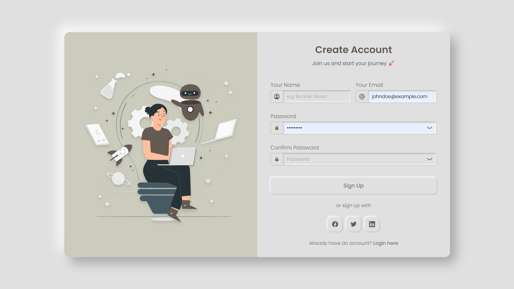
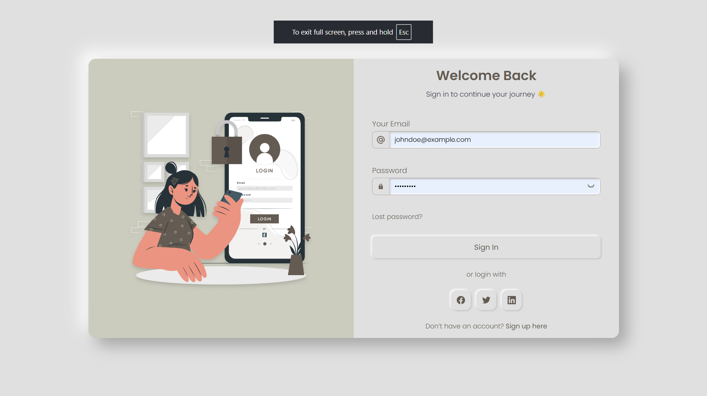
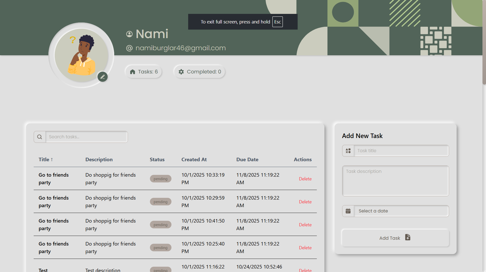
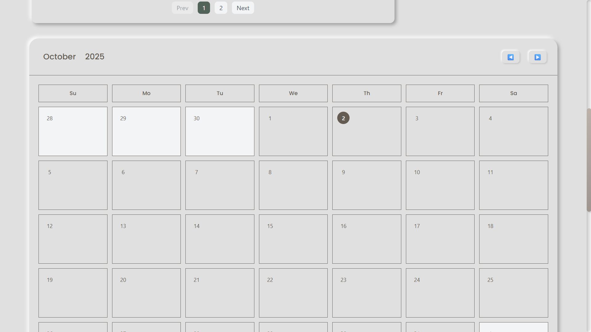
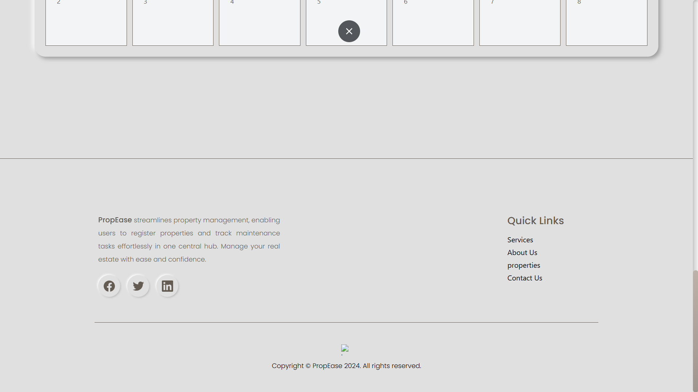
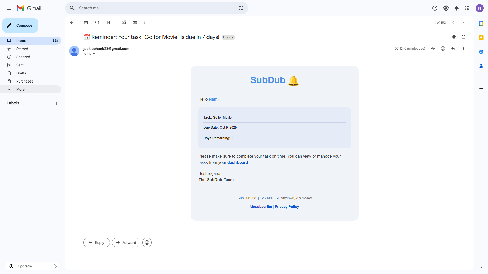

Absolutely! Here's an **enhanced README** with badges, emojis, and mentioning **rate limiting with Arcjet**. I’ve also kept placeholders for screenshots.

---

# 

    

🚀 A **modern, interactive dashboard** with **neumorphic design**, **task management**, **calendar integration**, **subscriptions tracking**, and **rate-limiting** for enhanced backend security. Built with **React, TypeScript, and Node.js**.

---

## 📑 Table of Contents

- [✨ Features](#-features)
- [🛠 Tech Stack](#-tech-stack)
- [📂 Project Structure](#-project-structure)
- [🖼 Screenshots](#-screenshots)
- [⚡ Installation](#-installation)
- [🎯 Usage](#-usage)
- [🔗 API Integration](#-api-integration)
- [🚀 Future Improvements](#-future-improvements)
- [📄 License](#-license)

---

## ✨ Features

| Feature                      | Description                                                                                      |
| ---------------------------- | ------------------------------------------------------------------------------------------------ |
| **🔒 Authentication**        | JWT-based sign-up/sign-in with protected routes, persisted login using Zustand.                  |
| **📝 Task Management**       | Create, read, update, delete tasks with status tracking (pending/completed/expired).             |
| **🔍 Sorting & Filtering**   | Sort tasks by `title`, `description`, `status`, `createdAt`, `dueDate`. Filter tasks easily.     |
| **📊 Pagination**            | Fetch tasks with page and limit support for optimal performance.                                 |
| **📅 Calendar Integration**  | Custom date picker & calendar dashboard showing tasks on due dates.                              |
| **🗓 Month/Year Selection**   | Animated modals for month & year selection using Framer Motion.                                  |
| **📧 Reminders & Workflows** | Upstash Workflows send email reminders for upcoming tasks.                                       |
| **💳 Subscriptions**         | Track subscriptions with frequency, category, price, and renewal date; automatic status updates. |
| **🎨 Neumorphic Design**     | Consistent modern neumorphic UI for buttons, inputs, modals, and cards.                          |
| **🎬 Animations**            | Smooth animations using Framer Motion for buttons, date tiles, and loading screens.              |
| **📱 Responsive UI**         | Fully responsive calendar, modals, and dashboard layout.                                         |
| **🛡 Rate Limiting**          | Arcjet middleware to protect API endpoints from abuse and prevent spam.                          |

---

## 🛠 Tech Stack

**Frontend**

- React + TypeScript
- Tailwind CSS (Neumorphic design)
- Framer Motion (Animations)
- Zustand (State management)
- Axios (API calls)
- Day.js (Date handling)

**Backend**

- Node.js + Express + TypeScript
- MongoDB + Mongoose
- JWT Authentication
- Upstash Workflows (Task reminders)
- Arcjet (Rate limiting)
- CORS enabled

---

## 📂 Project Structure

```
client/
├── src/
│   ├── api/          # Axios API calls
│   ├── components/   # Buttons, modals, inputs, calendar, task cards
│   ├── pages/        # Dashboard, Auth pages, Calendar
│   ├── assets/       # Images, Pharases, Icons, Lottie, index, avatar
│   ├── constants/    # Images, Pharases, Icons, Lottie, index, avatar
│   ├── routes/       # AppRoute, ProtectedRoute
│   ├── store/        # Zustand stores
│   ├── utils/        # Constants, helpers
│   ├── types/        # Interfaces, types
│   └── App.tsx
server/
├── controllers/      # Auth, Task, Subscription, Workflow controllers
├── models/           # User, Task, Subscription Mongoose models
├── routes/           # Express routes
├── middlewares/      # Authorization, rate-limiting (Arcjet), error handlers
├── utils/            # Helpers (email, validation)
└── app.ts
```

---

## 🖼 Screenshots

### 1. Auth Pages




### 2. Dashboard & Task & Calendar





### 4. Subscriptions



---

## ⚡ Installation

1. Clone the repository:

```bash
git clone <repo-url>
cd neumorphic-dashboard
```

2. Install dependencies:

```bash
# Frontend
cd client
npm install

# Backend
cd ../server
npm install
```

3. Create `.env` file in the server root:

```env
PORT=5500
MONGO_URI=<your-mongodb-uri>
JWT_SECRET=<your-jwt-secret>
JWT_EXPIRES_IN=7d
SERVER_URL=http://localhost:5500
UPSTASH_API_KEY=<your-upstash-api-key>
```

4. Start the project:

```bash
# Backend
cd server
npm run dev

# Frontend
cd ../client
npm run dev
```

---

## 🎯 Usage

1. Sign up and sign in to access the dashboard.
2. Create tasks with a due date.
3. View tasks on the calendar dashboard.
4. Click a date to view task details in a modal.
5. Manage subscriptions with renewal notifications.

---

## 🔗 API Integration

- **Auth Routes**

  - `POST /api/v1/auth/sign-up`
  - `POST /api/v1/auth/sign-in`
  - `GET /api/v1/auth/:id` (fetch user)

- **Tasks**

  - CRUD routes with pagination and filtering
  - Fetch by month: `/api/v1/tasks/month?month=MM&year=YYYY`

- **Subscriptions**

  - CRUD routes with auto renewal & status update

- **Workflow**

  - `/api/v1/workflows/task/reminder` (send task reminders)

- **Security**

  - Arcjet rate limiting applied to sensitive endpoints

---

## 🚀 Future Improvements

- Drag-and-drop tasks for prioritization
- Task categories with color-coding on calendar
- Real-time notifications with WebSockets
- Dark/light mode support with neumorphic theme
- Mobile-optimized layout

---

## 📄 License

MIT License © [Narendra Samanta]

---
